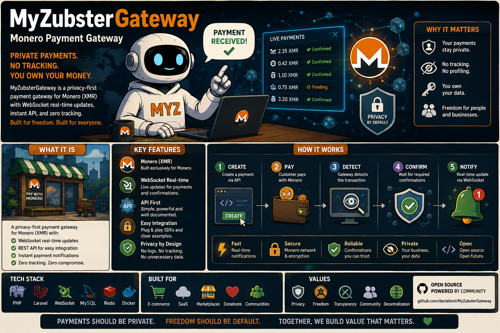

# MyZubster Gateway

<p align="center">
  
</p>

> 🌍 **Understand MyZubster in your language:** [Global multilingual guide](https://github.com/MyZubster-Ecosystem/myzubster/blob/main/docs/i18n/README.md) — English, Italiano, Español, Français, Deutsch, Português, 中文, 日本語, 한국어, العربية, हिन्दी, Русский, Türkçe, Bahasa Indonesia, Polski, Українська, বাংলা, اردو, فارسی, Kiswahili.
>
> MyZubster connects real-world observations, verifiable evidence, collaborative bounties and platform rewards. **MYZ is currently an internal reward/accounting ledger; external XMR/token/blockchain settlement is separate and independently verified.**

Backend integration boundary for the MyZubster ecosystem, including API, order, webhook, registry and payment/settlement-related components.

## Project status

**MVP / active validation.** The repository contains working backend components and automated tests. Payment, settlement and external-provider integrations are environment-dependent until the corresponding integration and independent-verification checks are green.

The Gateway is not the canonical authority for declaring an external payment final.

## Ecosystem role

```text
MyZubster core
      |
      v
Gateway / adapters
      |
      v
payment/treasury provider
      |
      v
independent verifier
      |
      v
CONFIRMED / PAID
```

See:

- [Ecosystem Architecture](https://github.com/MyZubster-Ecosystem/myzubster/blob/main/docs/ECOSYSTEM.md)
- [Canonical Bounty System](https://github.com/MyZubster-Ecosystem/myzubster/blob/main/BOUNTIES.md)
- [`BOUNTIES.md`](BOUNTIES.md) for Gateway-specific bounty scope.

## Stack

- Node.js 20+
- Express
- MongoDB / Mongoose
- wallet/provider integrations where configured
- JWT authentication
- security headers/CORS/rate limiting
- automated tests

## Quick start

```bash
git clone https://github.com/MyZubster-Ecosystem/MyZubsterGateway.git
cd MyZubsterGateway
npm ci
```

Create `.env` from the repository template and configure only environment-specific values. Never commit production credentials.

Start using the current package scripts, typically:

```bash
npm start
```

## Tests

```bash
npm test
```

Payment/settlement work should test negative paths including provider failure, timeout, duplicate/replay, wrong recipient, wrong amount/network and unavailable verification.

## Settlement contract

Settlement is deliberately separate from normal application flow.

A safe external lifecycle is:

```text
PENDING -> RESERVED/ACCEPTED -> SUBMITTED -> CONFIRMED -> PAID
```

Additional states may include `FAILED`, `UNSETTLED`, `DISPUTED` and `CANCELLED`.

Important rules:

- an application/database update is not chain/payment proof;
- a provider/adapter response alone cannot mark `PAID`;
- transaction id/hash, recipient, asset, network and canonical amount must match expected settlement data;
- unavailable verification must fail closed rather than infer success;
- MYZ in the current core platform is an internal reward/accounting ledger, not automatically an on-chain transaction.

## API surface

Main areas may include:

| Area | Examples |
|---|---|
| Health | `/api/health` |
| Authentication | `/api/auth/*` |
| Users | `/api/users/*` |
| Orders | `/api/orders/*` |
| Payments | `/api/payments/*` |
| Webhooks | `/api/webhooks/*` |
| Registries | animal/plant or related integration routes |

Verify the current router/controller source before building an external integration against a historical endpoint list.

## Security / production checklist

Before production deployment verify:

- dependency/security checks;
- secrets from deployment environment, not Git;
- HTTPS/TLS and network restrictions;
- JWT/key rotation;
- authentication/authorization and rate limiting;
- database backup/rollback;
- provider/RPC authentication/network controls;
- idempotency and duplicate prevention;
- observable retry/failure behavior;
- independent settlement verification;
- health checks and monitoring.

**Never commit private keys, wallet seeds, passwords or production credentials.**

## Bounties

Gateway work can be bountied for API, security, integration, reconciliation, testing and documentation tasks. Issue/PR/merge does not prove external payment. Follow the canonical bounty and settlement contracts linked above.

## Contributing

Create a feature branch, add/update tests, run the relevant checks and open a PR linked to the issue.

## License

MIT License. See [LICENSE](./LICENSE).

---

## Official project identity

MyZubster is maintained within the [MyZubster-Ecosystem](https://github.com/MyZubster-Ecosystem) organization. Canonical public administrator/maintainer reference: **[Daniel Ioni (@DanielIoni-creator)](https://github.com/DanielIoni-creator)**.

This link is a stable public project-identity reference. By itself, it is not a cryptographic signature or legal identity certification.
