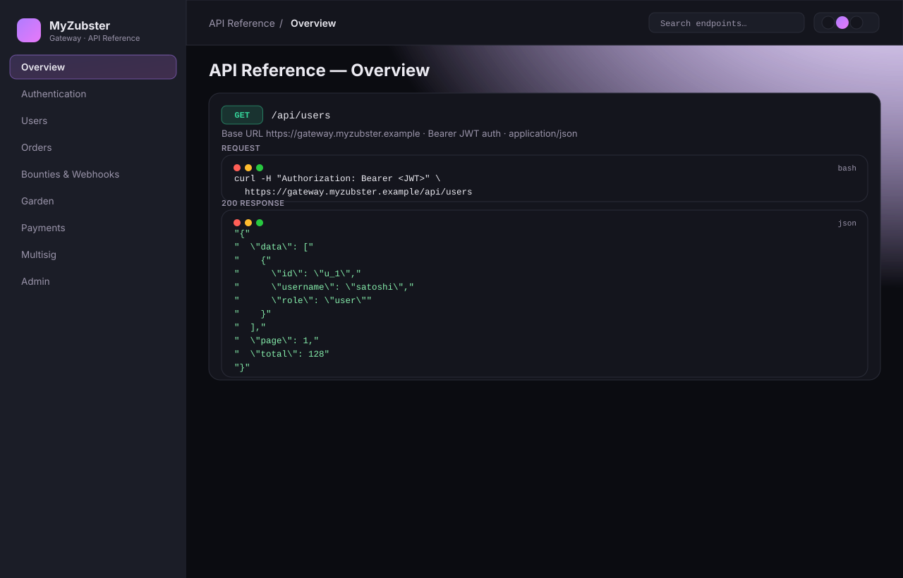
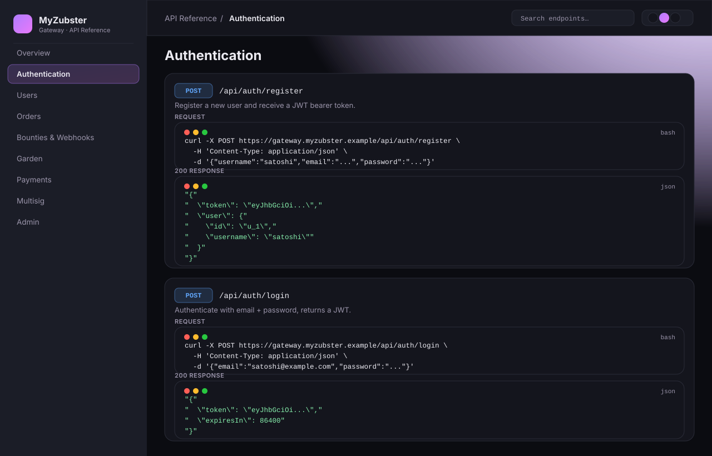
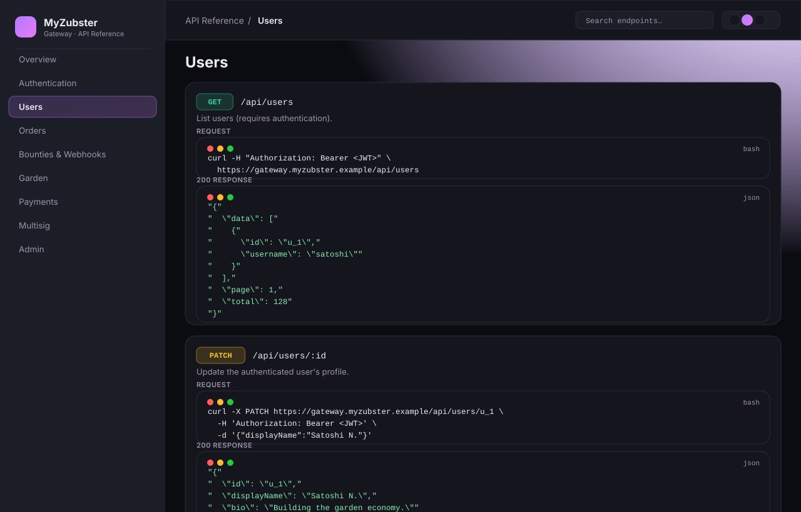
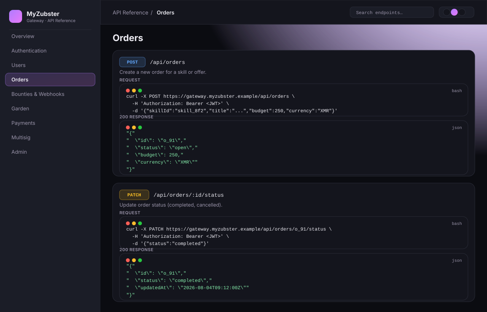
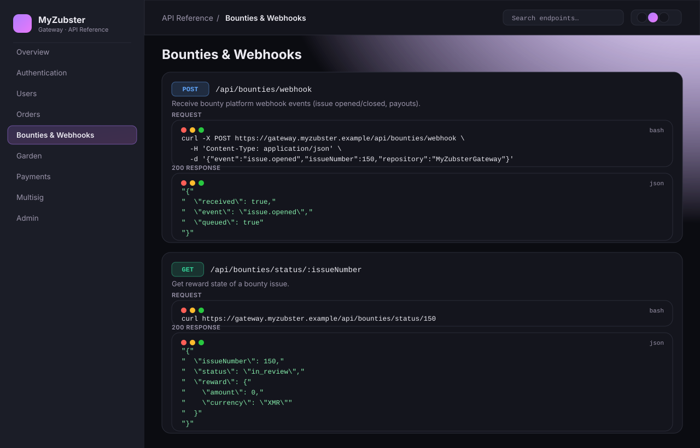
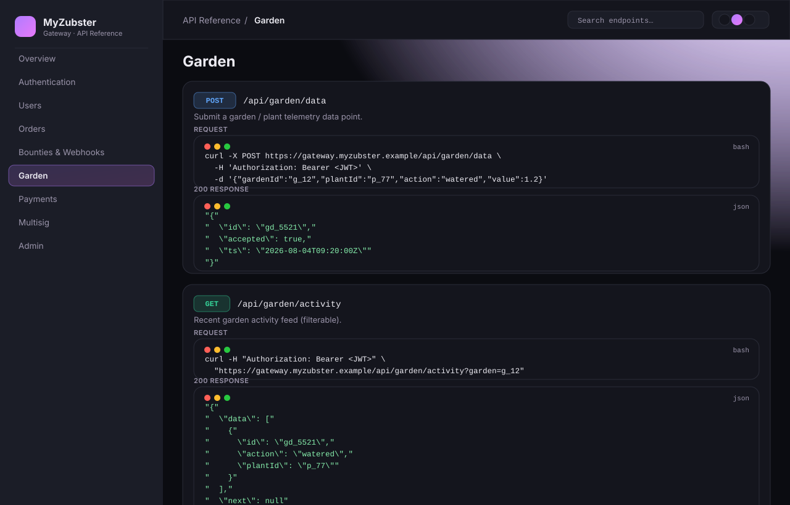
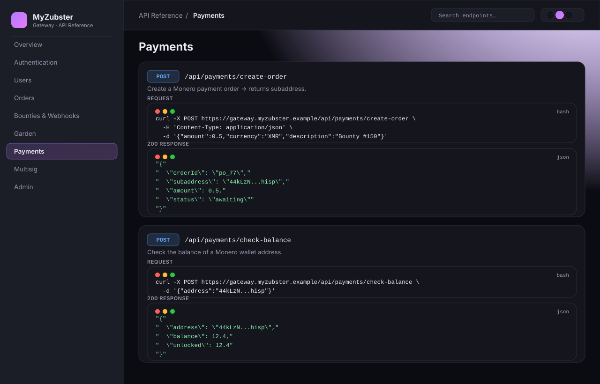
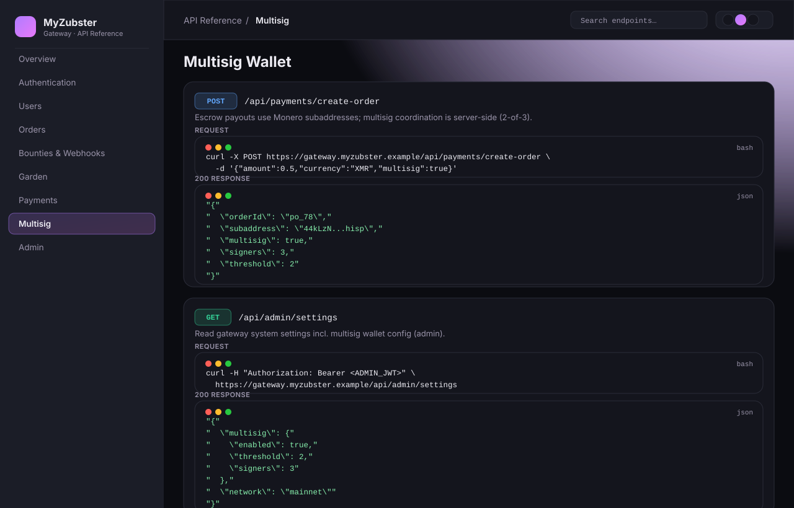
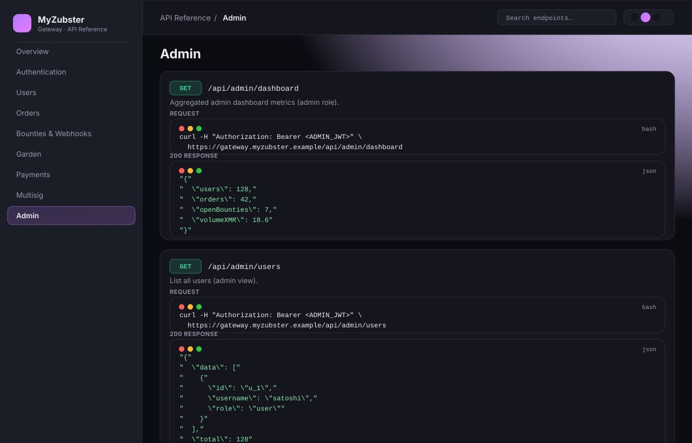
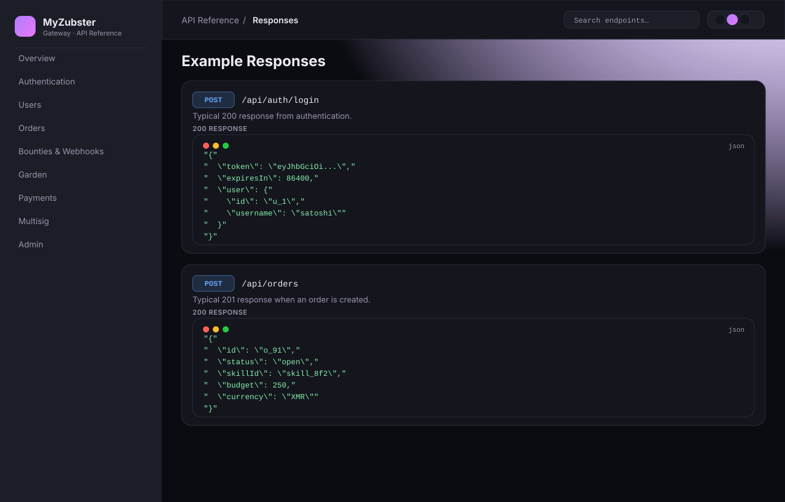

# MyZubsterGateway — API Endpoint Reference

> Visual, copy-pasteable reference for the MyZubsterGateway REST API.
> Each section below pairs a rendered **API reference view** (screenshot) with the
> exact methods, paths, request bodies and example `200` responses.

**Base URL**

```
https://gateway.myzubster.example
```

**Conventions**

| Item | Value |
|------|-------|
| Authentication | `Authorization: Bearer <JWT>` (most endpoints) |
| Content-Type | `application/json` |
| Response format | JSON |
| Method colors | `GET` · `POST` · `PATCH` · `PUT` · `DELETE` |

> **Note on the screenshots** — the images in `images/api/*.svg` are rendered
> views of the in-app documentation UI (same design tokens as the dashboard),
> generated to document the live endpoint surface. They reflect the endpoints
> listed below, which are sourced from the app's API catalog
> (`frontend/src/data/apiEndpoints.js`).

---

## Table of Contents

1. [Overview](#overview)
2. [Authentication](#authentication)
3. [Users](#users)
4. [Orders](#orders)
5. [Bounties & Webhooks](#bounties--webhooks)
6. [Garden](#garden)
7. [Payments](#payments)
8. [Multisig Wallet](#multisig-wallet)
9. [Admin](#admin)
10. [Example Responses](#example-responses)

---

## Overview



The gateway exposes a versioned REST API mounted under `/api/<module>`. All
non-public endpoints require a bearer JWT obtained from
`POST /api/auth/login`. Requests and responses are JSON.

```bash
curl -H "Authorization: Bearer <JWT>" \
  https://gateway.myzubster.example/api/users
```

```json
{
  "data": [
    { "id": "u_1", "username": "satoshi", "role": "user" }
  ],
  "page": 1,
  "total": 128
}
```

---

## Authentication



| Method | Path | Auth | Description |
|--------|------|------|-------------|
| `POST` | `/api/auth/register` | – | Register a new user, returns a JWT. |
| `POST` | `/api/auth/login` | – | Authenticate with email + password, returns a JWT. |

**Register**

```bash
curl -X POST https://gateway.myzubster.example/api/auth/register \
  -H 'Content-Type: application/json' \
  -d '{"username":"satoshi","email":"satoshi@example.com","password":"sup3rs3cret"}'
```

```json
{ "token": "eyJhbGciOi...", "user": { "id": "u_1", "username": "satoshi" } }
```

**Login**

```bash
curl -X POST https://gateway.myzubster.example/api/auth/login \
  -H 'Content-Type: application/json' \
  -d '{"email":"satoshi@example.com","password":"sup3rs3cret"}'
```

```json
{ "token": "eyJhbGciOi...", "expiresIn": 86400 }
```

---

## Users



| Method | Path | Auth | Description |
|--------|------|------|-------------|
| `GET` | `/api/users` | ✅ | List users. |
| `GET` | `/api/users/:id` | ✅ | Get a single user profile. |
| `PATCH` | `/api/users/:id` | ✅ | Update the authenticated user's profile. |

**List users**

```bash
curl -H "Authorization: Bearer <JWT>" \
  https://gateway.myzubster.example/api/users
```

**Update profile**

```bash
curl -X PATCH https://gateway.myzubster.example/api/users/u_1 \
  -H 'Authorization: Bearer <JWT>' \
  -d '{"displayName":"Satoshi N.","bio":"Building the garden economy."}'
```

```json
{ "id": "u_1", "displayName": "Satoshi N.", "bio": "Building the garden economy." }
```

---

## Orders



| Method | Path | Auth | Description |
|--------|------|------|-------------|
| `GET` | `/api/orders` | ✅ | List orders for the authenticated user. |
| `POST` | `/api/orders` | ✅ | Create a new order for a skill or offer. |
| `GET` | `/api/orders/:id` | ✅ | Get a single order. |
| `PATCH` | `/api/orders/:id/status` | ✅ | Update order status (`completed`, `cancelled`). |

**Create order**

```bash
curl -X POST https://gateway.myzubster.example/api/orders \
  -H 'Authorization: Bearer <JWT>' \
  -d '{"skillId":"skill_8f2","title":"Smart-contract review","budget":250,"currency":"XMR"}'
```

```json
{ "id": "o_91", "status": "open", "budget": 250, "currency": "XMR" }
```

**Update status**

```bash
curl -X PATCH https://gateway.myzubster.example/api/orders/o_91/status \
  -H 'Authorization: Bearer <JWT>' \
  -d '{"status":"completed"}'
```

```json
{ "id": "o_91", "status": "completed", "updatedAt": "2026-08-04T09:12:00Z" }
```

---

## Bounties & Webhooks



| Method | Path | Auth | Description |
|--------|------|------|-------------|
| `POST` | `/api/bounties/webhook` | – | Receive bounty platform webhook events. |
| `GET` | `/api/bounties/status/:issueNumber` | – | Get reward state of a bounty issue. |
| `PUT` | `/api/bounties/:issueNumber` | – | Update bounty assignment / lifecycle. |

**Webhook event**

```bash
curl -X POST https://gateway.myzubster.example/api/bounties/webhook \
  -H 'Content-Type: application/json' \
  -d '{"event":"issue.opened","issueNumber":150,"repository":"MyZubsterGateway"}'
```

```json
{ "received": true, "event": "issue.opened", "queued": true }
```

**Bounty status**

```bash
curl https://gateway.myzubster.example/api/bounties/status/150
```

```json
{ "issueNumber": 150, "status": "in_review", "reward": { "amount": 0, "currency": "XMR" } }
```

---

## Garden



| Method | Path | Auth | Description |
|--------|------|------|-------------|
| `POST` | `/api/garden/data` | ✅ | Submit a garden / plant telemetry data point. |
| `GET` | `/api/garden/:id/stats` | ✅ | Aggregate stats for a garden. |
| `GET` | `/api/garden/activity` | ✅ | Recent garden activity feed (filterable). |
| `GET` | `/api/garden/activity/stream` | ✅ | Live activity SSE stream (`text/event-stream`). |
| `GET` | `/api/garden/filters` | ✅ | Available filter values for the activity feed. |

**Submit telemetry**

```bash
curl -X POST https://gateway.myzubster.example/api/garden/data \
  -H 'Authorization: Bearer <JWT>' \
  -d '{"gardenId":"g_12","plantId":"p_77","action":"watered","value":1.2}'
```

```json
{ "id": "gd_5521", "accepted": true, "ts": "2026-08-04T09:20:00Z" }
```

**Activity feed**

```bash
curl -H "Authorization: Bearer <JWT>" \
  "https://gateway.myzubster.example/api/garden/activity?garden=g_12"
```

```json
{ "data": [ { "id": "gd_5521", "action": "watered", "plantId": "p_77" } ], "next": null }
```

---

## Payments



| Method | Path | Auth | Description |
|--------|------|------|-------------|
| `POST` | `/api/payments/create-order` | – | Create a Monero payment order → returns subaddress. |
| `GET` | `/api/payments/status/:orderId` | – | Check status of a payment order. |
| `POST` | `/api/payments/check-balance` | – | Check balance of a Monero wallet address. |

**Create payment order**

```bash
curl -X POST https://gateway.myzubster.example/api/payments/create-order \
  -H 'Content-Type: application/json' \
  -d '{"amount":0.5,"currency":"XMR","description":"Bounty #150"}'
```

```json
{ "orderId": "po_77", "subaddress": "44kLzN...hisp", "amount": 0.5, "status": "awaiting" }
```

**Check balance**

```bash
curl -X POST https://gateway.myzubster.example/api/payments/check-balance \
  -d '{"address":"44kLzN...hisp"}'
```

```json
{ "address": "44kLzN...hisp", "balance": 12.4, "unlocked": 12.4 }
```

---

## Multisig Wallet



Escrow payouts are settled through Monero subaddresses coordinated by a
**multisig wallet** (2-of-3 threshold). The exposed primitives are the payment
order endpoints above; deeper multisig coordination (signer rotation, partial
signatures) is handled server-side and surfaced via admin settings.

| Method | Path | Auth | Description |
|--------|------|------|-------------|
| `POST` | `/api/payments/create-order` | – | Create an escrow order marked `multisig: true`. |
| `GET` | `/api/admin/settings` | 👑 | Read gateway settings incl. multisig wallet config. |

**Multisig escrow order**

```bash
curl -X POST https://gateway.myzubster.example/api/payments/create-order \
  -H 'Content-Type: application/json' \
  -d '{"amount":0.5,"currency":"XMR","multisig":true}'
```

```json
{ "orderId": "po_78", "subaddress": "44kLzN...hisp", "multisig": true, "signers": 3, "threshold": 2 }
```

**Wallet config (admin)**

```bash
curl -H "Authorization: Bearer <ADMIN_JWT>" \
  https://gateway.myzubster.example/api/admin/settings
```

```json
{ "multisig": { "enabled": true, "threshold": 2, "signers": 3 }, "network": "mainnet" }
```

---

## Admin



All admin endpoints require the `admin` role (👑).

| Method | Path | Auth | Description |
|--------|------|------|-------------|
| `GET` | `/api/admin/dashboard` | 👑 | Aggregated dashboard metrics. |
| `GET` | `/api/admin/users` | 👑 | List all users (admin view). |
| `GET` | `/api/admin/settings` | 👑 | Read gateway system settings. |

**Dashboard**

```bash
curl -H "Authorization: Bearer <ADMIN_JWT>" \
  https://gateway.myzubster.example/api/admin/dashboard
```

```json
{ "users": 128, "orders": 42, "openBounties": 7, "volumeXMR": 18.6 }
```

---

## Example Responses



Representative `200` payloads for quick reference.

**`POST /api/auth/login`**

```json
{ "token": "eyJhbGciOi...", "expiresIn": 86400, "user": { "id": "u_1", "username": "satoshi" } }
```

**`POST /api/orders`**

```json
{ "id": "o_91", "status": "open", "skillId": "skill_8f2", "budget": 250, "currency": "XMR" }
```

**`POST /api/payments/create-order`**

```json
{ "orderId": "po_77", "subaddress": "44kLzN...hisp", "amount": 0.5, "status": "awaiting" }
```

---

## License

Part of MyZubsterGateway. See repository `LICENSE` for details.
