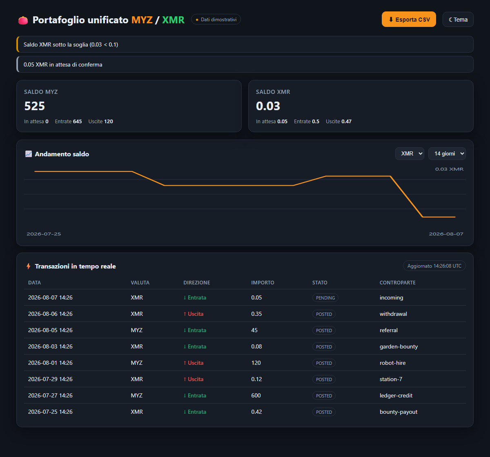

# Unified MYZ/XMR wallet dashboard

A single page showing both balances, live transactions, a balance chart, CSV export and threshold alerts.

Served at **`/wallet-dashboard`** (optionally `?userId=…`).



## What it shows

- **Saldo MYZ e XMR** — available, pending, inflow and outflow per currency, derived from the transaction list rather than read from a stored field.
- **Transazioni in tempo reale** — the 25 most recent entries, refreshed every 10 seconds.
- **Grafici performance** — closing-balance line per currency over 7, 14 or 30 days.
- **Export report** — CSV of the current transaction set.
- **Notifiche saldo** — low-balance, negative-balance and pending-funds banners.

## Structure

| File | Role |
| --- | --- |
| `frontend/dist/wallet-dashboard.html` | Markup, styling, DOM wiring |
| `frontend/dist/assets/wallet-dashboard.js` | Pure logic — no DOM, unit tested |
| `tests/walletDashboard.test.js` | 16 tests over that logic |

The logic lives outside the page so it can be tested. A dashboard whose only verification is "it looked right in a screenshot" hides arithmetic bugs, and this one does arithmetic about money. The module is a UMD wrapper, so the same file serves the browser and `node --test`.

**No CDN.** The chart is inline SVG drawn from a computed path; no charting library, no external stylesheet, nothing to break when a CDN is unreachable or an integrity hash drifts.

## Details that are deliberate

**Empty days appear in the chart.** The series has one point per day whether or not anything happened. A chart that plots only days with activity compresses a quiet week into a busy-looking line.

**Activity older than the window becomes an opening balance.** A 14-day chart on a wallet funded a month ago starts from the real balance, not from zero.

**A flat line is drawn mid-box, not along the floor.** A balance pinned to the bottom reads as "empty wallet"; the correct reading is "nothing moved".

**Low-balance alerts consider settled funds only.** A pending deposit does not silence the warning, because it cannot be spent yet — but it does raise its own informational banner so the user knows why the number looks low.

**CSV export neutralises formula injection.** A cell beginning with `=`, `+`, `-` or `@` is prefixed with an apostrophe. A `reference` field containing `=cmd|calc!A1` would otherwise execute when the exported file is opened in Excel, and references come from user input.

**Demo data when the API is unreachable.** The page renders sample transactions rather than a blank screen, and the pill in the header reads *Dati dimostrativi* in amber instead of *Dati live* in green — nobody should mistake placeholder numbers for their balance.

## Data source

`GET /api/wallet/:userId/transactions?limit=200`, matching the wallet API in #773. Any endpoint returning `{ items: [{ createdAt, currency, direction, amount, state, counterparty, reference }] }` works.

## Tests

```
node --test tests/walletDashboard.test.js
```

16 passing — per-currency precision, balance derivation, pending funds excluded from available, float-drift resistance, the day-series including gaps, opening balance folding, sparkline geometry staying inside its box, flat and single-point series, each alert rule, CSV escaping and formula-injection neutralisation.
